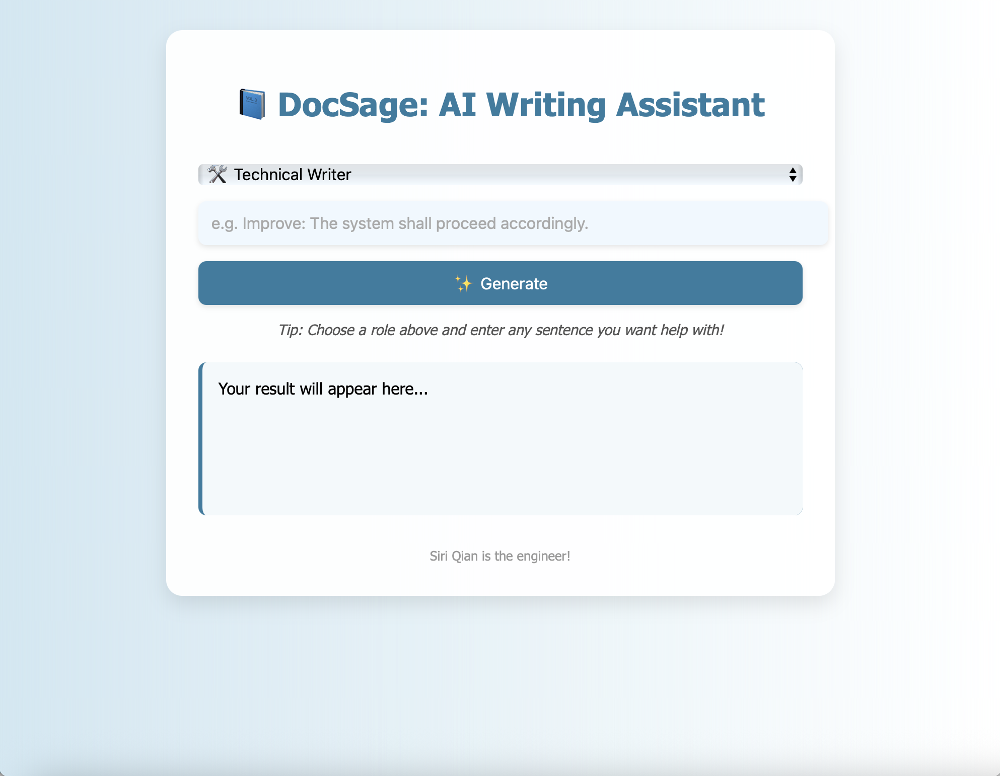
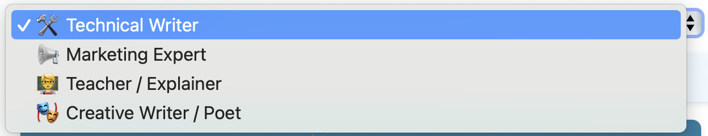
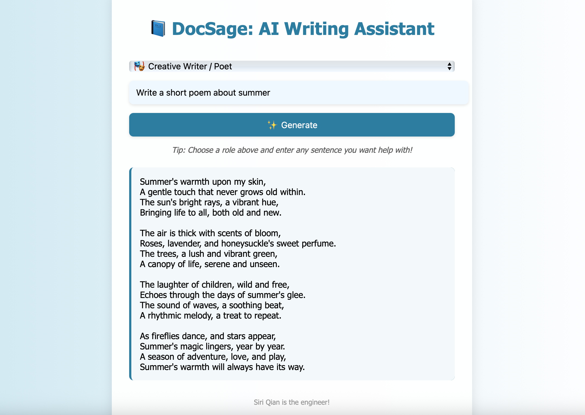

# 🧠 LLM Dosage Demo — A Lightweight Frontend for Prompting Large Language Models

This project is a simple yet functional frontend application that allows users to interact with a large language model (Meta Llama 3.3 70B) via a secure backend API built with Node.js.

## 🎯 Project Goal

The goal of this project is to explore how large language models can be integrated into user assistance workflows by building an interactive tool that enables role-based prompting, input customization, and a user-friendly UI — all while maintaining secure API handling.

## 🚀 Features

- 🔐 Secure API key management using `.env` and Express backend proxy  
- 💬 Prompt input and response display  
- 👥 Role selection (e.g., Friendly Assistant, Strict Teacher, Curious Child)  
- 🎨 Soft blue theme with fun emoji animations  
- ⚙️ Fully working POST requests to a real LLM API (Meta/llama-3.3-70b-instruct)  
- ✅ GitHub-safe: `.env` file excluded via `.gitignore`

## 🛠️ Tech Stack

- **Frontend**: HTML, CSS, JavaScript  
- **Backend**: Node.js, Express  
- **API**: Meta’s LLM API (secured via environment variables)

## 📸 Screenshots

### 🖼️ Homepage Interface



### 🧑‍💻 Role Selection Interface



### 🤖 LLM Response Example



## 📦 Project Structure

```
llm-dosage-demo/
├── index.html         # Frontend UI
├── server.js          # Node.js backend
├── .env               # API key (excluded from Git)
├── .gitignore         # Prevents uploading sensitive files
├── package.json       # Node project metadata
```

## 🔧 How to Run Locally

1. Clone the repository:
   ```bash
   git clone https://github.com/Siri-cod/llm-dosage-demo.git
   cd llm-dosage-demo
   ```

2. Install dependencies:
   ```bash
   npm install
   ```

3. Create a `.env` file in the root directory and add your API key:
   ```
   API_KEY=your-real-api-key-here
   ```

4. Start the server:
   ```bash
   node server.js
   ```

5. Open `index.html` in your browser and start chatting!

## 🔒 Notes

- The `.env` file is intentionally excluded from version control  
- The API key is never exposed in frontend code

## 🧑‍💻 Author

Siri(Xinrui) Qian ([@Siri-cod](https://github.com/Siri-cod))  
Master's Student in Quantitative Data Science Methods  
University of Tübingen